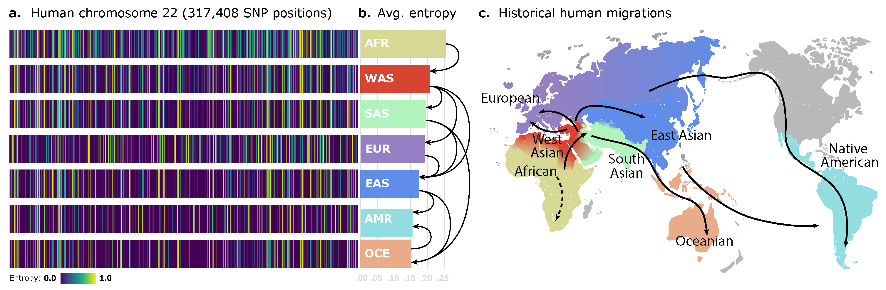

# ægen [](https://doi.org/10.1101/2023.09.27.558320)



ægen is a meta-autoencoder which allows to customize the shape of the autoencoder (regular, window-based, or hybrid) and specify the desired latent space distribution (Gaussian, Multi-Bernoulli, or VQ-VAE). Additionally, it allows to use conditioning and/or denoising modes. If you find this paper or implementation useful, please consider citing our bioRxiv preprint!
```{tex}
@article{geleta2023aegen,
	author = {Margarita Geleta and Daniel Mas Montserrat and Xavier Giro-i-Nieto and Alexander G Ioannidis},
	title = {Deep Variational Autoencoders for Population Genetics},
	year = {2023},
	doi = {10.1101/2023.09.27.558320},
	URL = {https://www.biorxiv.org/content/early/2023/09/28/2023.09.27.558320},
	eprint = {https://www.biorxiv.org/content/early/2023/09/28/2023.09.27.558320.full.pdf},
	journal = {bioRxiv}
}
```

## Dependencies

### Environment setup
Assuming a Python virtual environment is set up, the dependencies can be installed with:
```console
$ pip3 install -r requirements.txt
```
The whole project has been developed with Python 3.6.1 and PyTorch 1.4.0.

### Data

#### *Founders' dataset*
Human dataset – the human dataset is composed of public-use human whole genome sequences collected from real world-wide populations. The three sources are the listed below:
- [The 1000 genomes project](http://www.nature.com/articles/nature15393), reporting genomes of 2504 individuals from
26 populations from all continents.
- [The Human Genome Diversity Project](https://science.sciencemag.org/content/367/6484/eaay5012), adding 929 diverse genomes
from 54 geographically, linguistically, and culturally diverse human population.
- [The Simons Genome Diversity Project](https://www.nature.com/articles/nature18964), providing genomes from 300
individuals from 142 diverse populations.

The dataset was pruned to contain only single-ancestry origin individuals, i.e., individuals whose four grandparents self-reported belonging to the same ancestral group. After pruning, the dataset resulted in 2965 single-ancestry phased human genomes, each containing a maternal and paternal copy. For that reason, each sequence could be expanded into two, doubling the number of sequences to 5930, to which we refer as *founders*.

#### Dataset filesystem
The whole code is mounted on a specific data filesystem tree. First, it is needed to define the enviroment variables with the data paths. Those paths can be defined in the `scripts/ini.sh` script: `$USER_PATH` is the environment variable pointing to the root of this repository, `$IN_PATH` is the path for incoming data (training, validation and test sets), and `$OUT_PATH` is the path for outgoing data (logs). 

The input data filesystem is defined as follows:
```
$IN_PATH
└─ data
    ├─ human
    │   ├─ sample maps -> EUR, EAS, AMR, SAS, AFR, OCE, WAS
    │   ├─ human HapMap genetic map (.gmap)
    │   ├─ reference panel metadata (.tsv)
    │   ├─ chr22
    │   │   ├─ VCF file (.vcf)
    │   │   └─ prepared
    │   │       ├─ train -> HDF5 files with single-ancestry simulated data
    │   │       ├─ valid -> HDF5 files with single-ancestry simulated data
    │   │       └─ test  -> HDF5 files with single-ancestry simulated data
    │   └─ other chr can be added
    └─ other species can be added
```

#### Data augmentation
Two types of data augmentation have been used: (1) **offline** and (2) **online**. Offline data augmentation precomputes the training set data before starting training the model, whereas online simulation simulates new data samples on-the-fly. In this section, steps to perform offline simulation are explained. In order to specify which type of simulation to use, define that in the `params.yaml` file in the root folder of this repository.

*Founders* have been split in three non-overlapping groups with proportions 80%, 10% and 10%, to generate the training, validation and test sets. For each
set, several datasets have been simulated with the corresponding subset of founders using Wright-Fisher simulation within each population separately and basing the recombination on the human HapMap genetic map. 

In order to run the offline simulation, execute the following commands:
```console
$ cd scripts
$ source ini.sh
## Create single-ancestry maps for training, validation, and test:
$ python3 $USER_PATH/src/utils/mapper.py --species [species]
## Simulate single-ancestry individuals within each split.
$ python3 $USER_PATH/src/pyadmix/admix.py [vcf file] $OUT_PATH/data/[species]/chr[chr_number]/prepared/ [desired num of generations] [desired num of ind/gen]
## Create HDF5 datasets for each split with the specified number of SNPs.
$ cd ../src
$ species=[species to generate]
$ chm=[chm number to generate]
$ split=[data split to generate]
$ ini=[initial snp position]
$ end=[final snp position]
$ python3
> from utils.assemblers import create_dataset; import logging;
> logging.basicConfig(level=logging.INFO)
> log = logging.getLogger(__name__)
> create_dataset('$species','$chm',split='$split',arange=($ini,$end))
```
In order to use the online simulator in code, use the following constructor:
```python3
online_simulator = OnlineSimulator(
    species = [species to generate],
    chm = [chm number to generate],
    batch_size = [batch size],
    single_ancestry=[True/False], 
    granular_simulation=[True/False],
    mode = 'uniform',
    balanced = [True/False],
    device = [use cuda for GPU],
)
simulated_snps, simulated_labels = online_simulator.simulate(num_generation_max=max_gen)
```

## Training
The proposed method consists of a highly-adaptable and modular autoencoder that accepts flags to switch to conditioning mode, use different encoder/decoder architectures and specifiy the distribution at the bottleneck of the model. Furthermore, the model accepts two sets: (1) **a set of fixed parameters**, which defines the shape of the network, conditioning, number and size of layers in the encoder/decoder, dropouts, batch normalization and activation functions; (2) **a set of hyperparameters**, which defines optimizer flags and values, such as, the learning rate, weight decay, data augmentation simulation mode, among others. All of those parameters and hyperparameters are defined in the `params.yaml` file in the root folder of this repository. Once both sets have been specifies, a training session can be started by using:
```console
$ cd scripts
$ source ini.sh

## Store the params.yaml file used in this experiment in $OUT_PATH
$ rm -rf $OUT_PATH/experiments/exp[number]
$ mkdir -p $OUT_PATH/experiments/exp[number]
$ cp $USER_PATH/params.yaml $OUT_PATH/experiments/exp[number]/
$ touch $OUT_PATH/experiments/exp[number]/exp[number].log
$ chmod +rwx $OUT_PATH/experiments/exp[number]/exp[number].log

$ python3 $USER_PATH/src/trainer.py \
--species human \
--chr 22 \
--params $OUT_PATH/experiments/exp[number]/params.yaml \
--num [number] \
--verbose False \
--evolution False
```
Or, if using a Slurm queue, running `./submit.sh experiment=[number]` in the `scripts` folder.

## Evaluation

### Compression benchmarks
To run the compression benchmarks, please refer to the script under `src/eval/compressors.py` for more details, which has the constructor for running the benchmark with the VQ-VAE in the loop:
```python3
import time
sys.path.insert(0, '/home/users/geleta/aegen/src')
from eval.compressors import *

lzae = LZAE([experiment number])

start_time = time.time()
benchmark = lzae.benchmark(
    data=snps.astype(bool),  # snps is a HDF5 dataset
    batch_size=[batch size], 
    algorithms=['genozip'],  # or 'zstd'
    shuffle=blosc.NOSHUFFLE
)
end_time = time.time()
print(benchmark)
```
For the rest of comparisons, we ran the following commands:
```console
$ time gzip -9 -c $OUT_PATH/data/[species]/[chm number]/prepared/test/compression_bench_test_subset.h5 \
> $OUT_PATH/data/[species]/[chm number]/prepared/test/compressed_test_subset_gzip9.gz

$ time ./zpaqd c 3 $OUT_PATH/data/[species]/[chm number]/prepared/test/compressed_test_subset_zpaq.zpaq \
$OUT_PATH/data/[species]/[chm number]/prepared/test/compression_bench_test_subset.h5

$ time zstd $OUT_PATH/data/[species]/[chm number]/prepared/test/compression_bench_test_subset.h5 \
> $OUT_PATH/data/[species]/[chm number]/prepared/test/compressed_test_subset_zst.zst

$ time ./genozip --input generic --force -o $OUT_PATH/data/[species]/[chm number]/prepared/test/compressed_test_subset_genozip.genozip \
$OUT_PATH/data/[species]/[chm number]/prepared/test/compression_bench_test_subset.h5
```
For bref3, we first convert the HDF5 dataset to a VCF, and then we run the following command:
```console
$ time java -jar bref3.17Dec24.224.jar $OUT_PATH/data/[species]/[chm number]/prepared/test/to_bref3.vcf \
> $OUT_PATH/data/[species]/[chm number]/prepared/test/compressed_test_subset_bref3.bref
```

## License
NOTICE: This software is available for use free of charge for academic research use only. Academic users may fork this repository and modify and improve to suit their research needs, but also inherit these terms and must include a licensing notice to that effect. Commercial users, for profit companies or consultants, and non-profit institutions not qualifying as "academic research" should contact `geleta@berkeley.edu`. This applies to this repository directly and any other repository that includes source, executables, or git commands that pull/clone this repository as part of its function. Such repositories, whether ours or others, must include this notice.
